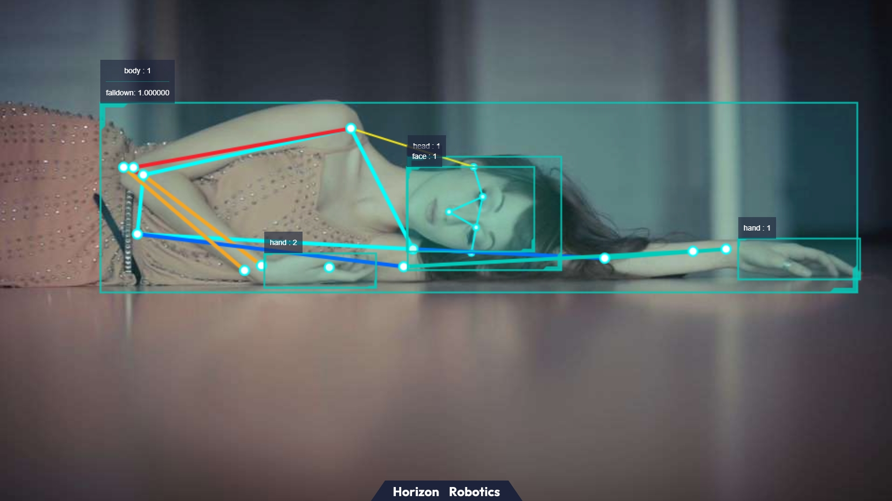

English| [简体中文](./README_cn.md)

# Function Introduction

The hobot_falldown_detection package subscribes to ai_msgs and determines whether a person has fallen down after receiving body_kps data, then publishes a fall event with a human fall detection algorithm example. The body_kps data is obtained from the subscribed ai_msgs. The fall event is published using a custom Hobot ai_msgs for users to subscribe to this topic for application development.

# Compilation

## Dependencies

ROS package:

- ai_msgs

ai_msgs is a custom message format used for receiving body_kps data and publishing inference results. The ai_msgs pkg is defined in the hobot_msgs.

### Development Environment

- Programming Language: C/C++
- Development Platform: X3/X86
- System Version: Ubuntu 20.0.4
- Compilation Toolchain: Linux GCC 9.3.0/Linaro GCC 9.3.0

### Compilation

Supports compiling on X3 Ubuntu system and cross-compiling using docker on a PC.

#### Compilation on Ubuntu System

1. Compilation Environment Confirmation

   - X3 Ubuntu system is installed on the board.
   - The current compilation terminal has set the TogetherROS environment variable: `source PATH/setup.bash`. Where PATH is the installation path of TogetherROS.
   - ROS2 compilation tool colcon has been installed, installation command: `pip install -U colcon-common-extensions`

2. Compilation

- Compilation command: `colcon build --packages-select hobot_falldown_detection`

#### Docker Cross-Compilation

1. Compilation Environment Confirmation

- Compilation is done in docker, and TogetherROS has been installed in docker. For docker installation, cross-compilation instructions, TogetherROS compilation, and deployment, please refer to the README.md in the robot development platform robot_dev_config repo.

2. Compilation

- Compilation command:

```bash
export TARGET_ARCH=aarch64
export TARGET_TRIPLE=aarch64-linux-gnu
export CROSS_COMPILE=/usr/bin/$TARGET_TRIPLE-

colcon build --packages-select hobot_falldown_detection \
   --merge-install \
   --cmake-force-configure \
   --cmake-args \
   --no-warn-unused-cli \
   -DCMAKE_TOOLCHAIN_FILE=`pwd`/robot_dev_config/aarch64_toolchainfile.cmake
```

## Notes

# User Guide

## Dependencies

- mipi_cam package: publish image msg
- websocket package: render image and ai perception msg
- mono2d_body_detection package: human pose keypoint detection

## Parameters

| Parameter       | Explanation                | Required | Default Value | Remarks |
| --------------- | -------------------------- | -------- | ------------- | ------- |
| paramSensivity | Sensitivity 0:ExLow, 1:Low, 2:Middle, 3:High | No | 3 |            |
| body_kps_topic_name | Subscribed topic for kps_point | No | hobot_mono2d_body_detection | |
| pub_smart_topic_name | Topic to publish intelligent results | No | falldown_event |  |

## Running

After a successful build, copy the generated install path to the Horizon X3 development board (if compiling on X3, skip the copying step), and run the following command

### **Ubuntu**

To run, use ros2 run startup method:

```bash
export COLCON_CURRENT_PREFIX=./install
source ./install/setup.bash

# Copy the config as an example of the model used, copy based on the actual installation path
# If compiling on board side (without --merge-install compile option), copy command is cp -r install/PKG_NAME/lib/PKG_NAME/config/ ., where PKG_NAME is the specific package name.

cp -r install/lib/mono2d_body_detection/config/ .

# Start the image publishing package
ros2 run mipi_cam mipi_cam --ros-args -p out_format:=nv12 -p image_width:=960 -p image_height:=544 -p io_method:=shared_mem --log-level error &

# Start jpeg image encoding & publishing pkg
ros2 run hobot_codec hobot_codec_republish --ros-args -p channel:=1 -p in_mode:=shared_mem -p in_format:=nv12 -p out_mode:=ros -p out_format:=jpeg -p sub_topic:=/hbmem_img -p pub_topic:=/image_jpeg --ros-args  --log-level error &

# Start monocular RGB body, head, face, hand bounding box, and body keypoints detection pkg
ros2 run mono2d_body_detection mono2d_body_detection --ros-args --log-level error &

# Start web display pkg
ros2 run websocket websocket --ros-args -p image_topic:=/image_jpeg -p image_type:=mjpeg -p smart_topic:=/hobot_falldown_detection --ros-args --log-level error &

# Start fall-down detection pkg
ros2 run hobot_falldown_detection hobot_falldown_detection --ros-args -p paramSensivity:=3 -p body_kps_topic_name:=hobot_mono2d_body_detection -p pub_smart_topic_name:=/hobot_falldown_detection

Run method 2, using launch file:

export COLCON_CURRENT_PREFIX=./install
source ./install/setup.bash

# Copy the model in the config to the actual installation path
# If compiling on the edge (without the --merge-install option), the copy command is cp -r install/PKG_NAME/lib/PKG_NAME/config/ ., where PKG_NAME is the specific package name.

cp -r install/lib/mono2d_body_detection/config/ .

# Start the launch file
ros2 launch install/share/hobot_falldown_detection/launch/hobot_falldown_detection.launch.py
```

### **Linux**
```
export ROS_LOG_DIR=/userdata/
export LD_LIBRARY_PATH=${LD_LIBRARY_PATH}:./install/lib/

# Copy the model in the config to the actual installation path
cp -r install/lib/mono2d_body_detection/config/ .

# Start image publishing pkg
./install/lib/mipi_cam/mipi_cam --ros-args -p out_format:=nv12 -p image_width:=960 -p image_height:=544 -p io_method:=shared_mem --log-level error &

# Start jpeg image encoding & publishing pkg
./install/lib/hobot_codec/hobot_codec_republish --ros-args -p channel:=1 -p in_mode:=shared_mem -p in_format:=nv12 -p out_mode:=ros -p out_format:=jpeg -p sub_topic:=/hbmem_img -p pub_topic:=/image_jpeg --ros-args --log-level error &

# Start web display pkg
./install/lib/websocket/websocket --ros-args -p image_topic:=/image_jpeg -p image_type:=mjpeg -p smart_topic:=/hobot_falldown_detection --log-level error &

# Start monocular RGB body, head, face, hand bounding box, and body keypoints detection pkg
./install/lib/mono2d_body_detection/mono2d_body_detection --ros-args --log-level error &

# Start fall-down detection pkg
./install/lib/hobot_falldown_detection/hobot_falldown_detection --ros-args -p paramSensivity:=3 -p body_kps_topic_name:=hobot_mono2d_body_detection -p pub_smart_topic_name:=/hobot_falldown_detection
```

## Notes

To run the web display for the first time, you need to start the webserver service. Follow these steps:

- Navigate to the deployment path of WebSocket: `cd install/lib/websocket/webservice/` (For board-side compilation without the `--merge-install` option, use `cd install/websocket/lib/websocket/webservice`)
- Start nginx: `chmod +x ./sbin/nginx && ./sbin/nginx -p .`

# Analysis of Results

## Web Display Effect


